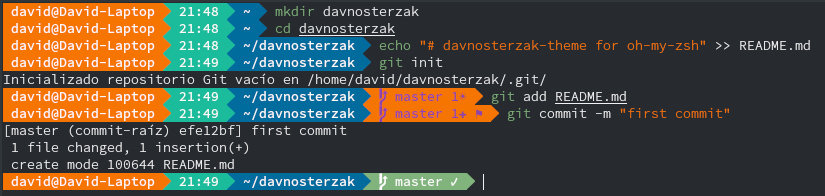
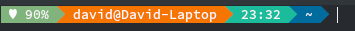
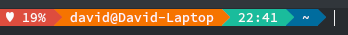
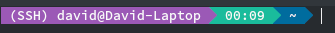
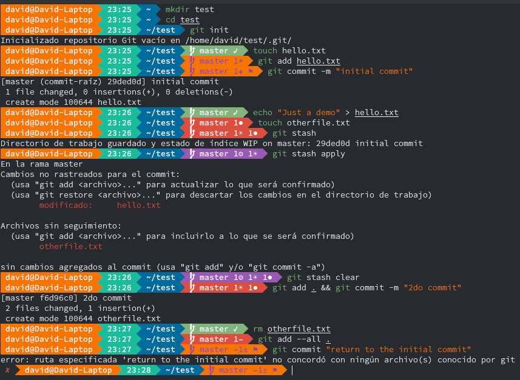
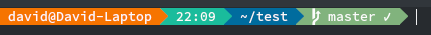

# DavnosterZak for oh-my-zsh

DavnosterZak is a [oh-my-zsh shell](https://github.com/robbyrussell/oh-my-zsh) theme based on the
[AgnosterZak Theme](https://github.com/zakaziko99/agnosterzak-ohmyzsh-theme) &
[Powerline Vim plugin](https://github.com/Lokaltog/vim-powerline)

It currently shows:
- Battery Life (in case of the laptop is not charging)
- Execution Time
- Current directory
- Git status
- User & Host status
- Virtual Environments

## Preview




## Other color schemes

It's better to use DavnosterZak with a Solarized dark color scheme or others dark color schemes.


## Requirements

In order to use the theme, you will first need:

* Powerline compatible fonts like [Vim Powerline patched fonts](https://github.com/Lokaltog/powerline-fonts), [Input Mono](http://input.fontbureau.com/) or [Monoid](http://larsenwork.com/monoid/).
* On Ubuntu like systems you'll need the `ttf-ancient-fonts` package to correctly display some unicode symbols that are not covered by the Powerline fonts above.
* A ZSH framework like [oh-my-zsh](https://github.com/robbyrussell/oh-my-zsh)


## Installing

After installing [oh-my-zsh](https://github.com/robbyrussell/oh-my-zsh)

1. Download the theme [here](http://raw.github.com/DavidL28D/davnosterzak-theme/master/davnosterzak.zsh-theme)

2. Put the file **davnosterzak.zsh-theme** in **$ZSH_CUSTOM/themes/**

3. Configure the theme in your **~/.zshrc** file:

```bash
ZSH_THEME="davnosterzak"
```

## Options

DavnosterZak is configurable. You can change colors and which segments you want or don't want to see. All options must be overridden in your **.zshrc** file.

## Segments

### Battery Life

The info will display in case of the laptop is not charging.
If you're using Arch Linux, install `acpi` package  with 

- `sudo pacman -S acpi`

|Battery status|Color|Preview|
|--------------|-----|-------|
|more than 39%|`green`|
|less than 40% and more than 19%|`yellow`|
|less than 20%|`red`|

### SSH conection



### Virtual environments


### Git


#### Color States
|Background Color & Foreground Color|Meaning
|----------------|----------------|
||Absolutely clean state
||There are stashed files
||There are new untracked files
||There are modified or deleted files but unstaged

#### Icons
|Icon|Meaning
|----|-------|
|`✔`|clean directory
|`☀`|new untracked files preceeded by their number
|`✚`|added files from the new untracked ones preceeded by their number
|`‒`|deleted files preceeded by their number
|`●`|modified files preceeded by their number
|`±`|added files from the modifies or delete ones preceeded by their number
|`⚑`|ready to commit
|`⚙`|sets of stashed files preceeded by their number
|`☊`|branch has a stream, preceeded by his remote name
|`↑`|commits ahead on the current branch comparing to remote, preceeded by their number
|`↓`|commits behind on the current branch comparing to remote, preceeded by their number
|`<B>`|bisect state on the current branch
|`>M<`|Merge state on the current branch
|`>R>`|Rebase state on the current branch

## Credits

This theme is based by the following themes:

- [Agnosterzak](https://github.com/zakaziko99/agnosterzak-ohmyzsh-theme)

**Note: The variation in colors is because a custom theme is being used.**